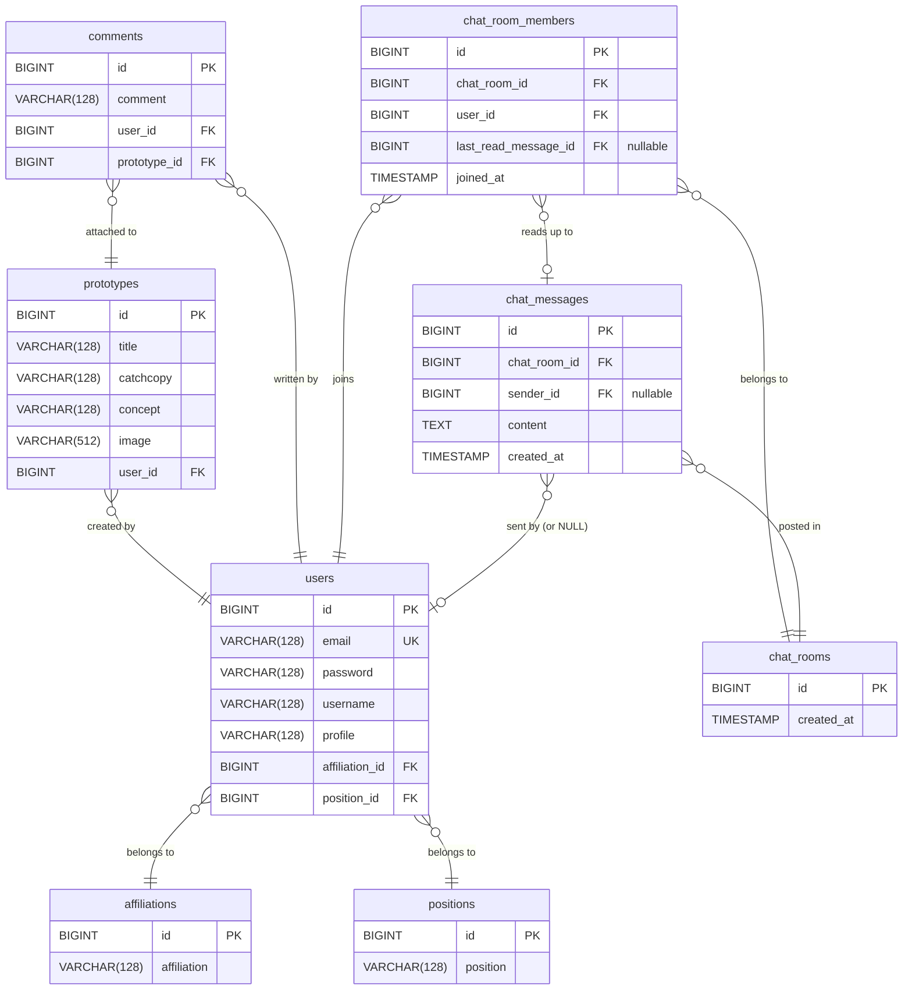

# ER図

```mermaid
erDiagram
    users }o--|| affiliations : "belongs to"
    users }o--|| positions : "belongs to"
    prototypes }o--|| users : "created by"
    comments }o--|| users : "written by"
    comments }o--|| prototypes : "attached to"
    chat_room_members }o--|| users : "joins"
    chat_room_members }o--|| chat_rooms : "belongs to"
    chat_room_members }o--o| chat_messages : "reads up to"
    chat_messages }o--o| users : "sent by (or NULL)"
    chat_messages }o--|| chat_rooms : "posted in"

    affiliations {
        BIGINT id PK
        VARCHAR(128) affiliation
    }

    positions {
        BIGINT id PK
        VARCHAR(128) position
    }

    users {
        BIGINT id PK
        VARCHAR(128) email UK
        VARCHAR(128) password
        VARCHAR(128) username
        VARCHAR(128) profile
        BIGINT affiliation_id FK
        BIGINT position_id FK
    }

    prototypes {
        BIGINT id PK
        VARCHAR(128) title
        VARCHAR(128) catchcopy
        VARCHAR(128) concept
        VARCHAR(512) image
        BIGINT user_id FK
    }

    comments {
        BIGINT id PK
        VARCHAR(128) comment
        BIGINT user_id FK
        BIGINT prototype_id FK
    }

    chat_rooms {
        BIGINT id PK
        TIMESTAMP created_at
    }
    
    chat_messages {
        BIGINT id PK
        BIGINT chat_room_id FK
        BIGINT sender_id FK "nullable"
        TEXT content
        TIMESTAMP created_at
    }

    chat_room_members {
        BIGINT id PK
        BIGINT chat_room_id FK
        BIGINT user_id FK
        BIGINT last_read_message_id FK "nullable"
        TIMESTAMP joined_at
    }
```
