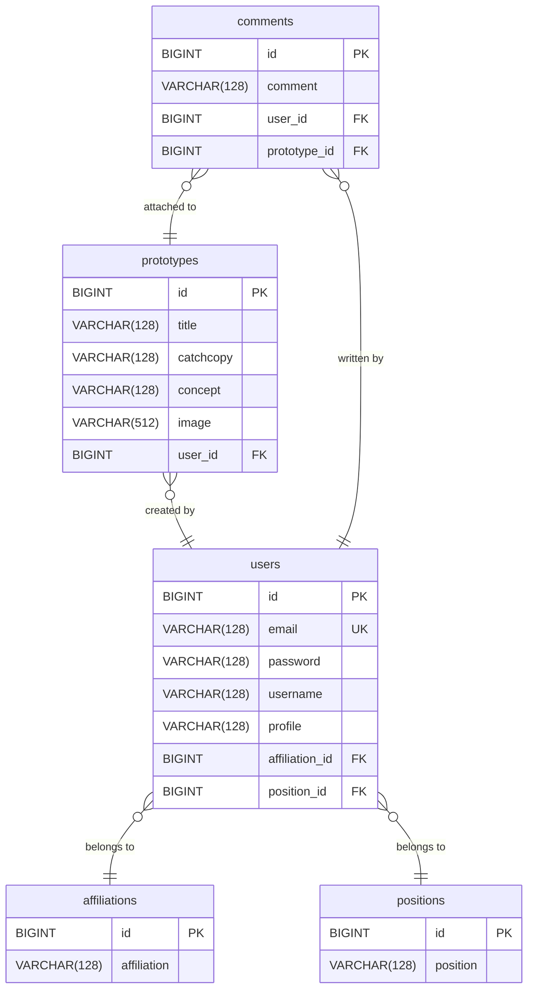

# ER図

```mermaid
erDiagram
    users }o--|| affiliations : "belongs to"
    users }o--|| positions : "belongs to"
    prototypes }o--|| users : "created by"
    comments }o--|| users : "written by"
    comments }o--|| prototypes : "attached to"

    affiliations {
        BIGINT id PK
        VARCHAR(128) affiliation
    }

    positions {
        BIGINT id PK
        VARCHAR(128) position
    }

    users {
        BIGINT id PK
        VARCHAR(128) email UK
        VARCHAR(128) password
        VARCHAR(128) username
        VARCHAR(128) profile
        BIGINT affiliation_id FK
        BIGINT position_id FK
    }

    prototypes {
        BIGINT id PK
        VARCHAR(128) title
        VARCHAR(128) catchcopy
        VARCHAR(128) concept
        VARCHAR(512) image
        BIGINT user_id FK
    }

    comments {
        BIGINT id PK
        VARCHAR(128) comment
        BIGINT user_id FK
        BIGINT prototype_id FK
    }
```
